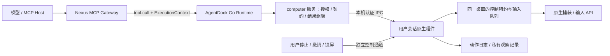
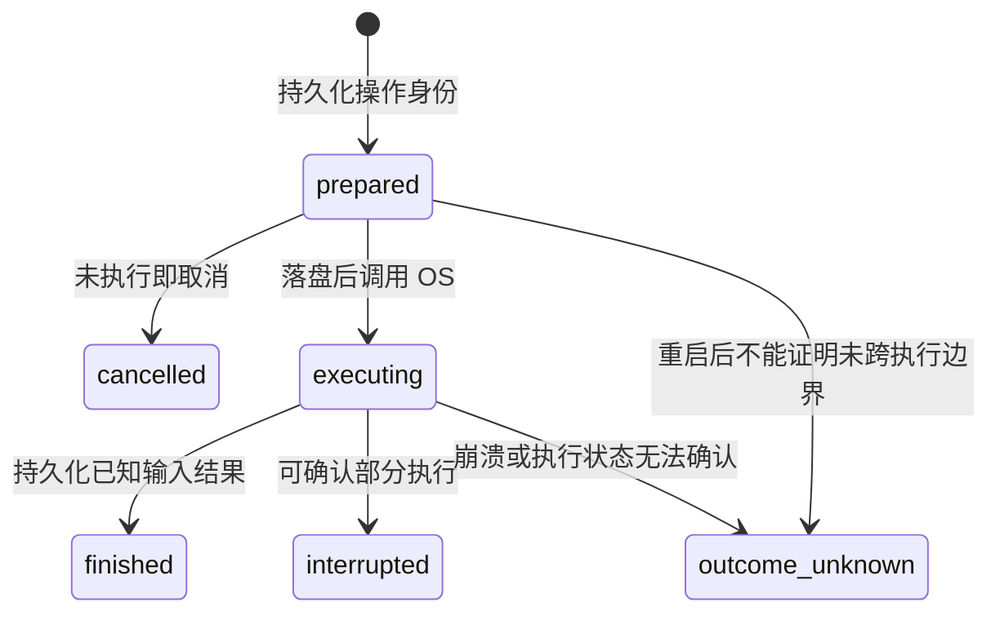

# 原生 Computer Use 设计草案

状态：设计草案 v0.1，可据此拆分实现；本文中的新类型、工具和路径均为拟新增内容。
日期：2026-09-13（America/Los_Angeles）。
基线：AgentDock `0e51c4b690e7`、NexusDock `c2bb473e9804`、agentdock-protocol `3e926f7aa779`。

## 1. 目标与首版范围

为 macOS / Windows 提供可观察、可取消、可恢复的原生桌面能力。模型经现有 WorkSession / Target 路由调用，由登录用户会话内的原生组件完成捕获和输入；结果明确区分“已调用输入 API”“系统接受输入”和“新的界面观察”。

首版交付五个工具：`computer_status`、`computer_session`、`computer_observe`、`computer_act`、`computer_stop`。会话工具显式管理桌面控制权，避免只读 status/observe 隐式抢占焦点；停止工具独立，便于撤销后的最小清理授权。

首版支持单个交互式桌面上的显示器截图、窗口定位、点击、移动、滚动、按键组合、文本输入、有限时长拖拽；支持多显示器逐屏观察和准确坐标转换。首发按现有 macOS arm64 / macOS 13+ 构建基线与 Windows x64 验收，不据此承诺未经测试的系统版本。AX / UI Automation 控件树与控件模式放在后续独立阶段，协议预留能力发现而非提前开放空实现。

首版不提供虚拟桌面隔离、不驱动登录/UAC安全桌面、不自动跨用户会话切换、不提供任意脚本动作、无限动作批次或跨请求保持的裸 key_down。Linux/headless 节点明确报告 unsupported，不回退到 shell 或 browser 工具。原生动作不会自动宣告业务完成条件通过。

## 2. 已确认的基础与缺口

| 现有位置 | 可复用能力 | 需要新增或修改 |
| --- | --- | --- |
| `internal/app/runtime.go`、`specs_registry.go`、`specs_browser.go` | 服务装配、ToolSpec、发现时 schema 编译 | 独立 computer 服务与 `specs_computer.go` |
| `desktop/macos/AgentDockApp/Sources/DesktopPermissionChecker.swift` | Accessibility / Screen Recording / Apple Events 权限 UI | 检测必须来自实际执行组件，当前面板结果不能当作后端授权 |
| `packaging/macos/build-app.sh`、`ServiceController.swift` | App bundle、用户 LaunchAgent、登录启动 | 原生组件打包、身份、签名、生命周期与权限 UI |
| `internal/desktopruntime/service_startup_windows.go` | 当前用户登录启动、elevated 计划任务模式 | 当前交互式用户会话中的原生组件；不能用 Core 在线状态推断桌面可操作 |
| `internal/desktopcontrol/` | 当前用户本地 IPC 实践 | 保留管理用途；桌面执行独立 endpoint 和协议 |
| `internal/tool/media/`、`internal/publicartifacts/` | 图片编码、hash、受限图片输出 | 私有且带 owner 的观察存储；不能直接复用公开签名 URL |
| `internal/tool/command/journal.go` | 原子持久化、去重、未知结果的设计模式 | 独立 computer action journal，不把桌面动作伪装为 command outcome |
| Nexus `internal/httpx/mcp_gateway.go` | `callNodeTool` / ExecutionContext / Target 路由 | computer 权限、历史清理操作分类、撤销传播 |

现有 native UI 没有屏幕捕获、CGEvent / SendInput 或控件操作后端。macOS Core 与其他 bundle helper 当前分别 ad-hoc 签名；正式分发前需要验证稳定签名身份及升级后的权限行为。Windows 已有桌面登录启动路径，不应笼统当成 Session 0 服务。

## 3. 架构与进程边界



- `agentdock-protocol` 定义跨仓 Go 类型、权限、错误码、公共输入输出 schema 的共享来源和原生 IPC wire version。
- `agentdock` 定义 Go 工具服务、原生 IPC 客户端、平台执行组件、真实权限检查、日志及私有观察存储。
- `nexusdock` 负责 owner、WorkSession、Target、Deployment revision 和撤销；继续由 Node 主动建立出站 WebSocket。
- 模型动作走已有 `OperationToolCall`，不用无 ExecutionContext 的 `runtime.request`。现有 Bridge v4 的 `tool.cancel` 用于取消等待与当前动作。
- 原生组件按 OS 用户登录会话单实例，最终输入租约和队列必须在该组件内，而非只放在某个 Go Runtime 的 mutex 中；同一桌面上两个 Core 实例也不能产生两条输入队列。
- 捕获回调、控制请求、输入队列、日志 IO 分开调度。停止请求不能排到耗时截图/控件查询/输入后面，也不持有 MCP Manager 全局锁。

### macOS 执行组件

新增 bundle 内独立 `AgentDockComputer.app`（Swift），以用户 LaunchAgent 启动，使用稳定 bundle ID，例如 `com.uvwt.agentdock.computer`。Go Core 不直接链接 AppKit 或继承面板的 TCC 结果。

组件自身完成非交互权限检测、用户触发的授权请求、ScreenCaptureKit 和 CGEvent 调用；面板读取它的状态并展示实际可执行文件身份。`status` 不自动弹权限框。签名、bundle 路径及升级行为在平台 spike 中实际验证，不能把当前 ad-hoc 签名视为已解决稳定权限授权。

IPC 使用用户私有目录中的 Unix socket：目录 0700、socket 0600、校验 peer UID、启动时绑定 Core 实例及原生组件 generation。请求带服务端签发的 execution grant；peer UID 与凭据只验证当前用户的可信进程边界，不声称能隔离同一用户可运行的任意恶意程序。

### Windows 执行组件

新增独立 C++ helper，以 DXGI / D3D11 捕获、SendInput 输入；后续 UIA 使用专门 COM MTA worker。这让 Go 工具服务不依赖全局 cgo，也能在原生组件失效时单独恢复。

组件在当前交互式用户 session 启动，回报 session ID、window station / desktop、完整性级别、锁屏与连接状态。沿用当前用户的登录启动模式；Core elevated 不表示 helper 应自动提权。首版不申请 UIAccess，也不自动提升权限来操作更高完整性级别的应用。

IPC 使用拒绝远程客户端的 named pipe，DACL 限定实际用户 SID；验证 peer 身份和 OS session，并与 Core 握手绑定。单凭 pipe 名字或传来的 session_id 不是授权。Windows 服务不能直接控制用户桌面，用户会话组件的设计依据见 [Interactive Services](https://learn.microsoft.com/en-us/windows/win32/services/interactive-services)。

## 4. 权限、协商与撤销

共享 `DeploymentPermissions` 新增 `computer` 枚举：`none | observe | control`。它类似现有 files 的分级，避免把读取桌面与输入合成一个 bool。缺失字段在数据迁移/归一化时取 none；持久化新快照写出明确值。更新 `Validate()` 时必须同时检查 files 与 computer，不能保留现有 files 分支的提前 return。

| 能力 | none | observe | control |
| --- | --- | --- | --- |
| 当前 Target 的后端能力/权限摘要 | 允许最小诊断，无屏幕内容或窗口标题 | 允许 | 允许 |
| 实时截图、窗口标题、后续 AX/UIA 树 | 拒绝 | 允许 | 允许 |
| 获取/续期输入租约、发送输入 | 拒绝 | 拒绝 | 允许 |
| 停止自己已经建立的会话 | 允许最小清理 | 允许 | 允许 |

Node FullAccess 继续覆盖 Deployment 细粒度 computer 权限，但不能覆盖 OS 权限、非交互式桌面、用户本地停用/接管状态或不受支持的平台。working_folder 不是桌面窗口/应用的隔离边界；Shell / FullAccess 仍可有其他 OS 通道。

能力 token 拟定为 `bridge.computer.v1`：只有具有完整会话、观察、输入、停止与结果查询契约的新版 Node 才发布该 token，后端尚未启动/无权限则在 status 报具体状态。工具本身仍经 Node Hello 的 ToolDescriptor 发现，不加入 Nexus 自有 canonical tool 列表。

Bridge 传输版本保持 v4，但权限 schema 与工具 schema 必须同步发布。给不支持新权限 schema 的旧 Node 应用新 Deployment 快照时明确返回 upgrade_required；不得静默丢掉 computer 字段，不增加 shell fallback。未升级节点已有功能无需因新增工具而被冒充支持。capability 校验覆盖 FullAccess 情况。

撤销路径：

1. Nexus 持久化 Target/WorkSession 撤销，再发送已有 revoke operation。
2. AgentDock 更新 Target 状态，同时通知 computer 服务取消该 owner 的排队动作、停止当前动作后续事件、清理注入按键并释放租约。
3. 原生组件在出队和每个有限输入片段前复验 grant/租约/desktop epoch；该检查与 stop 在组件内部有序处理。
4. Nexus 到 Node 的通知丢失时，不承诺即时撤销：远端 grant 使用可配置短租约（初始建议 15 秒），由仍在线且重新验证 Target 的 Nexus 通道续期；断线后不得无限续租。正在执行的原生片段最长 3 秒，是额外的收敛上界。
5. grant 绑定 owner、Target revision、Node connection generation 和绝对 expires_at。Nexus 在现有认证 Bridge 上发送授权续期，Go Core 经本机认证 IPC 转交；原生组件不接受模型提供的 grant。新增私有 `computer.grants.renew.v1` 批量控制消息需在协议阶段明确定义，不能借无上下文 runtime.request 续权。
6. 延迟到达的旧 grant 不得从接收时重新获得完整 TTL；时钟偏差超过允许范围时停止续期并报告 clock_untrusted。P0 测定偏差容忍（初始建议 2 秒），撤销收敛承诺必须加上这一误差。连接 generation 变化使旧消息失效。
7. 本机独立调用使用本机认证主体的同类 grant；不能利用断开 Nexus 自动转成本机授权。

历史 Target 只允许 `computer_stop` 和 `computer_status(operation_id)` 的已存结果元数据查询，均验证原 owner。无 operation_id 的实时 status、任何新截图、窗口枚举、session acquire/renew 或 act 都不能走历史豁免。三处必须一致：Nexus `allowsHistoricalTargetControl`、AgentDock Bridge prepare 分支、Runtime execution refresh 分支。实时 observe 在权限撤销后绝不继续采集。

## 5. 公共工具与核心类型

Nexus 的模型边界接收 work_session_id / target_id，按现有策略剥离并构造可信 ExecutionContext。以下字段是工具自身业务参数，不允许模型覆盖 node_id、权限或 OS 用户。

| 工具 | 主要输入 | 主要输出与语义 |
| --- | --- | --- |
| `computer_status` | 可选 operation_id | 后端/本地开关/权限/会话状态；指定 ID 时只读保存的动作结果，不续租、不启动授权弹窗 |
| `computer_session` | action=acquire/renew/release、desktop_id、已获得的 session_id | 控制租约、epoch、expires_at；忙时 desktop_busy，不静默抢占别人焦点 |
| `computer_observe` | desktop_id、display_id、可选 window_id/crop、max_size、可选 after_operation_id | 观察记录及一个标准 MCP image；与当前 owner 绑定，不获取输入租约 |
| `computer_act` | session_id、operation_id、observation_id、action、timeout_ms | 持久化动作结果、输入接受信息、动作后新观察或观察失败原因 |
| `computer_stop` | session_id、可选 operation_id | 停止本人会话/动作，幂等且不重新获取权限；本机用户“全部停止”由本地管理入口提供 |

核心类型：`ComputerCapability`、`ComputerBackendStatus`、`ComputerSession`、`ComputerObservation`、`ComputerAction`（判别联合）、`ComputerActionResult`、`ComputerEvidenceRecord`。

状态字段分开表达：`backend_state`（offline/starting/ready/degraded）、`desktop_state`（interactive/locked/disconnected/unsupported）、`permissions`（granted/denied/not_determined/unavailable）、`local_control_enabled`、`stop_latched`。窗口标题等桌面内容只在观察权限下返回，诊断不得顺便泄漏其他会话的 lease owner 身份。

`ComputerAction` 首版操作：`move`、`click`、`scroll`、`key`、`text`、`drag`。每种 action 有独立字段和 schema；拒绝未声明字段、非有限坐标及越界值。text 与 key 语义分开，文本不通过剪贴板隐式中转。输入模式明确，不在 AX/UIA 操作失败后自动降级坐标点击；后续语义控件操作使用新的显式 kind。

示例（已获得输入 session）：

```json
{
  "session_id": "cs_...",
  "operation_id": "cop_...",
  "observation_id": "obs_...",
  "action": {"kind":"click","point":{"x":450,"y":230},"button":"left","count":1},
  "timeout_ms": 15000
}
```

示例结果：

```json
{
  "operation_id":"cop_...",
  "state":"finished",
  "input":{"status":"accepted","accepted_events":2,"requested_events":2},
  "observation":{"status":"captured","observation_id":"obs_after_..."},
  "verification":{"status":"not_checked"},
  "replayed_result":false
}
```

macOS CGEventPost 是无返回值的投递函数，因此该路径只能给 `input.status=submitted`，不能伪造 accepted_events。Windows 的 accepted 是 SendInput 返回的实际事件数量，两者都不能推出应用业务成功。[CGEventPost](https://developer.apple.com/documentation/coregraphics/cgevent/post%28tap%3A%29?language=objc)、[SendInput](https://learn.microsoft.com/en-us/windows/win32/api/winuser/nf-winuser-sendinput)

### 错误与重试语义

每个错误携带 phase、operation_id（若已分配）、effects=none/partial/unknown 和 retryable；retryable 仅表示可以重读同一操作或在明确未执行后重试，不授权更换 ID 重放。

| 错误码（拟新增） | 语义 | 恢复方式 |
| --- | --- | --- |
| COMPUTER_UNSUPPORTED / COMPUTER_HELPER_OFFLINE | 平台不支持或组件不可达 | 查询状态/恢复组件，无 shell fallback |
| COMPUTER_PERMISSION_DENIED / COMPUTER_DESKTOP_UNAVAILABLE | 权限不足、锁屏或无交互式桌面 | 用户修复状态，重新观察 |
| COMPUTER_DESKTOP_BUSY | 其他 owner 占有输入租约 | 等待或显式再次 acquire，不能抢占 |
| COMPUTER_OBSERVATION_STALE | 观察过期或几何/输入代次变化 | 新 observe，重新决策 |
| COMPUTER_SESSION_REVOKED | session / grant / Target 已失效 | 停止清理；重新绑定不得续用旧 lease |
| COMPUTER_OPERATION_CONFLICT | 同 ID 请求内容不同 | 返回冲突，不执行 |
| COMPUTER_INPUT_REJECTED | 明确零输入被接受 | 返回平台信息，不自动重发 |
| COMPUTER_EXECUTION_UNKNOWN | 可能已执行、无法确认 | 同 ID 查询、新观察，不自动再执行 |
| COMPUTER_EVIDENCE_EXPIRED | 私有图像或证据 payload 已清理 | 保留历史 hash 和失效标记 |

## 6. 观察与坐标

每个 observation 保存：不可复用 ID、owner、desktop_id、desktop_epoch、geometry_revision、input_sequence、captured_at、expires_at、display/window identity、编码尺寸、原始捕获尺寸、crop、方向、原生坐标空间、image_to_native 变换和图像 SHA-256。

模型坐标统一是“本次返回图像左上角为原点的像素坐标”。首版每次返回一个 display tile；多显示器通过多次 observe 选择 display_id，不把混合 DPI 显示器拼成一张没有可靠全局缩放关系的图。

映射由后端保存并在 act 时读取；不接收模型回传的变换矩阵作为可信输入：

```text
native_x = a*x + c*y + tx
native_y = b*x + d*y + ty
```

矩阵包含截图裁剪、输出缩放和显示旋转。macOS 记录捕获像素到 CGEvent 坐标的转换；Windows helper 声明 Per-Monitor V2 DPI awareness，以物理虚拟桌面坐标计算，再转换为 SendInput absolute + virtual-desktop 范围。原点可为负数，不直接把主显示器的 scale 应用到其他显示器。[Apple 坐标与缩放说明](https://developer.apple.com/videos/play/wwdc2022/10155/)、[Windows MOUSEINPUT](https://learn.microsoft.com/en-us/windows/win32/api/winuser/ns-winuser-mouseinput)、[Windows DPI](https://learn.microsoft.com/en-us/windows/win32/hidpi/high-dpi-desktop-application-development-on-windows)

出队时检查 observation owner、TTL、desktop epoch、geometry revision 和 input sequence；窗口定向输入另复验窗口进程/创建代次/边界。窗口移动、显示器热插拔、旋转、DPI/分辨率变化使旧几何观察失效。每次本系统输入都推进 sequence；用户接管或焦点变化触发失效。TTL 不是“屏幕一定未变化”的证明，后台动画/页面刷新仍可能发生，操作后的真实观察不可省略。

动作后捕获要求捕获时间晚于最后一次输入完成的单调时钟时间。ScreenCaptureKit 不能返回动作前缓冲帧；DXGI 无新帧时可在确认捕获仍活跃且没有 dirty/move 更新后返回已确认未变化的当前画面，必须显式标注 `unchanged` 和 `verified_current_at`，不能给旧帧伪造新 captured_at。无法确认时返回 observation_unavailable，保留已发送输入结果。

截图只是一条观察事实。默认 verification=not_checked；后续显式、确定性的 predicate（例如某个已绑定 UIA 元素 value 等于期望值）才产生 verified / not_met。

## 7. 桌面互斥、取消和用户接管

输入租约按实际 OS 桌面串行，owner 至少包含 Node / WorkSession / Target / context revision。session 与租约 token 由服务端生成；猜测 session_id 不能取得控制权。建议租约 30 秒，并被远端 execution grant 有效期进一步限制。renew 显式检查当前权限；无活跃动作时过期释放，不通过只读轮询续命。

同一 owner 内可取消排队；首版队列上限 16、单次输入片段上限 3 秒，超时从 Go 工具入口开始计入。native worker 使用剩余时间，不在出队后重新获得完整 timeout。输入执行完再做后观察，观察失败不导致再执行输入。

- 尚未执行即取消：cancelled，effects=none。
- 部分事件已注入：interrupted，effects=partial/unknown，返回已知事件计数并尝试释放本组件持有的按键/鼠标按钮。
- 不能确认是否发送：outcome_unknown，禁止自动重放。
- 新的系统用户活动：暂停本 owner 输入并使观察失效；监测只记录活动发生和来源，不记录用户键入内容。系统不提供足够事件监测能力时 status 说明限制，但本地停止入口始终存在。
- 用户本地“停止全部操作”设置 stop_latched，同时停止新截图与输入，只有本地用户可重新启用；模型不能用 acquire 清除此标记。
- 针对本系统注入事件使用平台标记以免误判成用户接管。该标记是事件归类辅助，不是安全身份。

所有组合键/拖拽在同一有限动作内配对释放，不跨请求保持按下。finally、超时和 watchdog 均做清理；helper 被 OS 强杀时不能保证已经释放，重启检查记录并报告 keys_state_unknown，不能用“进程已停止”冒充桌面输入已恢复正常。已有物理按键按下时不抢改用户状态。

## 8. 动作日志、重试与故障恢复

原生组件是执行事实的最终持久化者：在触及 OS 前写 prepared / executing，完成后写输入结果与证据引用。Go Runtime 可以缓存/转发结果，但不能在 helper 未落盘时自行宣称执行成功。日志失败在输入前阻止执行；输入后落盘失败报告 outcome_unknown。

去重键是可信调用 owner + operation_id；digest 包含规范化动作、session/lease、observation 和执行身份，不包含 yield/输出大小偏好。与现有 command journal 复用原则和底层原子文件工具，独立记录模型，不依赖本轮仍未提交的 command 修改。



重复同 ID/同 digest 返回同一记录或进行中状态；同 ID/不同 digest 返回 operation_conflict。重启后不重放 prepared/executing；保守归为 unknown，旧 session/lease 立即失效。结果丢在 IPC/Bridge/MCP 任一段时都只重读同 ID，不重新注入。

unknown 后客户端可重新观察再决定下一步，但旧操作本身不能改成新 ID 自动重发。禁止 SDK、Go 服务或 helper 做工具写操作自动重试。这里保证的是受日志保留期和有效租约限制的“不自动重复执行”，不是跨文件系统与 OS 输入的分布式 exactly-once。

建议动作结果和去重记录保存 7 天；活动 lease 的记录不可清理。过期 lease 永不复用，因此日志清理后携带旧 lease 的重放仍会失败。若客户端用新 lease、新 ID 提交相同业务动作，这是新的显式操作，不作虚假的全局语义去重。

原始 text 不写日志或遥测；digest 用节点私有 key 的 HMAC，避免短密码/输入值的裸 hash 易被离线枚举。日志记录类型、长度、owner、时间、错误、观察 ID、图像 hash 和输入计数。截图存私有 observation store，默认 24 小时，项目策略可缩短，引用失效明确返回 expired；需要长期验收的证据另行固定保存。

## 9. 私有图像与 checkpoint 证据

首版 computer_observe 和 act 后观察直接返回标准 MCP image + 结构化 metadata，复用图片编码与 envelope 尺寸限制。默认最大边 1600px、原始编码不超过 2 MiB，总 Bridge JSON 控制在 4 MiB 内；超限时明确调整输出尺寸并同步矩阵，不能只裁断字节。现有 Bridge 总帧上限是 8 MiB，base64 开销必须计入。

现有 publicartifacts.Metadata 不携带 WorkSession/Target owner，发布会形成签名 URL。桌面截图默认不能走此公开发布路径。新增私有 observation store，用 owner、当前读取权限、TTL 和 hash 验证读取；图像不进入日志、node heartbeat 或普通运行状态。现有私有 artifact.read 也不能直接按 observation_id 读取而跳过 owner 校验。

MCP 输出层将现有 view_image 专用 `_mcp_image_*` 转换收敛到受控 image-result 适配器，只由已注册工具的可信结果构造。Nexus 转发同一图像契约；不让模型通过普通 JSON 字段伪造任意文件读取。

结合本轮新加的条件证据：

1. 保持 `task_manage.evidence` 的用户/模型输入为 self_reported。
2. 新增服务内部的可信 evidence 摄取函数，以 condition_id 关联 observation_id / operation_id、完整 owner、采集时间、payload hash、predicate 和 verifier version。
3. 引用已保存截图最多证明“采集了这张图”；若它被用来解释“登录成功”，该业务判断仍是 self_reported。
4. 只有受信任、确定性检查器执行具体 predicate，才能将对应检查事实记为 machine_verified；模型不能直接传此标签。
5. Task reopen 让旧 review revision 的证据不再满足当前终审，但保留历史记录；过期原始图像不能被报告为仍可复验。

首版默认按工具结果返回供模型关联证据，不隐式把 computer 动作写成任意 Task 的完成条件。可信 evidence 摄取作为独立阶段，与 task owner/项目绑定一起交付。

## 10. 平台后端约束

macOS：ScreenCaptureKit 复用 SCStream，只采屏幕，不默认采音频；空闲时停止流并在需要时重新建立。以回调实际帧与内容矩形计算坐标。AX 后续用于明确的元素操作；权限查询在实际 Swift helper 内执行。Apple 的信任 API明确针对当前进程，不能复用面板进程的 bool 当作执行许可。[SCStream](https://developer.apple.com/documentation/screencapturekit/scstream)、[AX 信任检查](https://developer.apple.com/documentation/applicationservices/1459186-axisprocesstrustedwithoptions?changes=_6)

Windows：每个输出维护 Desktop Duplication 对象，处理旋转、光标合成和 access-lost 后重建；锁屏、用户切换或断开的远程桌面先暂停输入、推进 epoch，再重建。UIA 查询与事件注册放在独立 MTA worker，避免控制 UI 线程被外部应用挂起。DXGI/UIA 后端阻塞不允许扩散到其他 MCP 服务。[Desktop Duplication](https://learn.microsoft.com/en-us/windows/win32/direct3ddxgi/desktop-dup-api)、[UIA 线程模型](https://learn.microsoft.com/en-us/windows/win32/winauto/uiauto-threading)

SendInput 必须比较请求数与返回数；零或部分插入返回 input_rejected / interrupted。UIPI 可能是原因，但 API 不一定能证明，应保留原始错误与完整性诊断，不能一概声称“被 UIPI 阻止”。CGEventPost 则只能报告 submitted。[SendInput 返回契约](https://learn.microsoft.com/en-us/windows/win32/api/winuser/nf-winuser-sendinput)

## 11. 实施拆分与文件清单

| 阶段 | 交付 | 主要文件/范围 | 验收退出条件 |
| --- | --- | --- | --- |
| P0 平台 spike | 两平台最小捕获+一次输入+新观察；macOS 身份/签名与 Windows 用户 session 验证 | 新 `desktop/macos/AgentDockComputer/`、`desktop/windows/computer-helper/` 实验入口及平台测试 App | 真机验证权限拒绝/授予、缩放坐标和停止；产出实际支持矩阵，不公开空能力 |
| P1 共享契约与权限 | Go 类型、schema、权限枚举、capability、默认拒绝与混合版本行为 | protocol 新 `computer.go`；`project.go`、`mcpcontract/output.go`；Nexus `scripts/generate-contracts.py`、Projects 三个前端组件 | schema 编译、默认 deny、FullAccess 与本地停用、旧节点明确 upgrade_required |
| P2 核心服务与模拟后端 | 会话互斥、owner、grant、日志、去重、取消、结果重读、私有 observation store | 新 `internal/tool/computer/`、`internal/computeripc/`、`internal/computerstate/`；`internal/app/specs_computer.go`、runtime/authorization | 确定性故障注入：不重复输入、无跨服务阻塞、跨 owner 不能读写、撤销清理 |
| P3 macOS 完整后端 | Swift 组件、SCK/CGEvent、权限 UI、签名/安装/升级 | `DesktopPermissionChecker.swift`、`ServiceController.swift`、`packaging/macos/build-app.sh`、安装与发布脚本 | 通过 macOS 真机矩阵，升级后 actual helper 权限状态可信 |
| P4 Windows 完整后端 | DXGI/SendInput、用户会话、DPI、pipe 身份与停止 | Windows helper、`service_startup_windows.go`、manifest、control-panel/tray、Windows 打包 | 通过混合 DPI/多屏/锁屏/UIPI/用户切换矩阵；无 Session 0 输入 |
| P5 Nexus 与证据闭环 | 路由、撤销、图像、可信证据绑定；控件能力另增 | Nexus `mcp_gateway.go`、`connections.go`、项目撤销链；AgentDock `nexusbridge/client.go`、`project_authorization.go`、MCP image envelope；taskstate evidence API | 双设备与多 WorkSession E2E、结果丢失重读、condition/review revision 关联 |

P0 与 P1 可并行；公开工具的 release 必须整合 P2、对应平台后端和 P5 的权限/撤销/图像路由部分。可以先发布 macOS，再发布 Windows，但不同平台保持相同 required fields/action enum，差异通过 capabilities 表达。AX/UIA 控件模式和机器 predicate 不阻塞坐标输入首版，也不能提前宣称已实现。

Nexus 具体同步点：`ProjectsPage.tsx` 的权限类型、`ProjectDetailPage.tsx` 的 draft/回填/序列化/开关、`ProjectSessionsPanel.tsx` 的展示，以及生成的 `internal/httpx/web_dist`。权限存于现有 permissions_json，无须为单个能力增加 SQLite 列；修订、Target 撤销及迁移测试必须同步。

## 12. 回归矩阵和性能观测

必须自动化覆盖：

- 工具 schema 拒绝未知字段、无效操作、越界/NaN 坐标；缺权限、缺 Target、其他 owner、旧 revision 不能输入或读实时桌面。
- 两个 WorkSession 竞争同一桌面只有一个 lease；等待取消及时返回；慢 native backend 不阻塞 command/MCP 服务或 stop 控制通道。
- prepared / executing / native 已完成 / 日志已完成 / Bridge 已发送各位置崩溃；同 operation ID 不多执行一次。
- Target/Deployment/Project/FullAccess 撤销、Node 断连、helper 重启、租约到期；grant 到期后停止继续输入，不保留旧焦点所有权。
- 截图裁剪/缩放、负原点、旋转、混合 DPI、显示器热插拔；返回图像坐标到真实输入点的误差由校准 App 验证。
- 窗口移动/遮挡/关闭、用户接管、旧 observation、被撤销后的 observation 读取、图像 TTL、payload 超限。
- text 不进入日志；组合键/拖拽取消后释放；helper 强杀如无法确认按键状态必须报告 unknown。
- 输入已发送而后截图失败：保留输入事实，禁止重新点击；没有 predicate 时不产生 machine_verified。

真机必测：macOS 首次安装/授权拒绝/重新授权/升级、Retina+外屏；Windows 100%/150%/200%混合 DPI、跨屏窗口、锁屏/解锁、elevated 应用、登录用户切换及 RDP 连接变化。无真机只能判定 Go/协议通过，不可宣布平台可用。

分段指标：queue_wait、grant_validate、native_connect、capture_wait、encode、input_submit、post_observe、journal_fsync、bridge_bytes、outcome_unknown_count。初始建议本地 stop 控制请求 P95 <100ms、普通暖截图 P95 <500ms；这些是待 P0 校准的工程目标，不是已有性能数据。磁盘/队列/图像上限是资源边界，不增加“必须写若干条说明”之类执行策略门槛。

下一步优先实施 P0：确认 actual helper 的权限身份和显示坐标；并把 P1 的类型/schema/权限测试落实为独立变更，再推进完整运行时。
